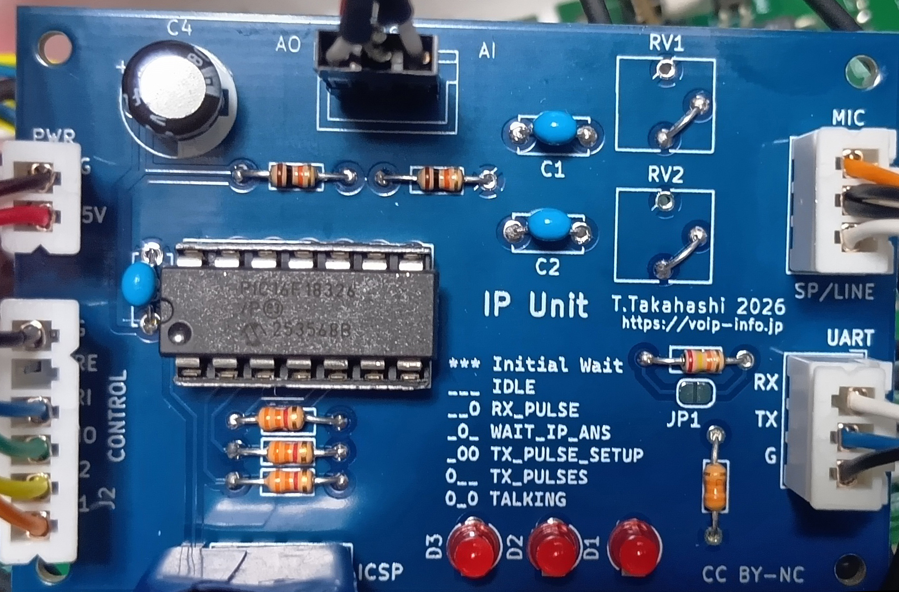

# IPユニット

## これは何？

アナログPBXをIP接続するためのユニットです。何とAsteriskとかと接続して遊ぶことができます。

とはいえ、いちからIP接続部分をつくるとSIPスタックをどうするのかとか大問題が起こるので、そこはちょっと工夫してうまいことやります。

## しくみ
IP接続、つまりSIP電話機部分は外部で動かすBareSIPに頼ります。BareSIPのAPIを使い、ここで作っているアナログPBXから呼制御を行います。つまりこうなります。

```
+-----Analog PBX-----+        +--------Linux SBC-------------+
|                    |        |                              |
| [Core]---[IP-UNIT]===(UART)===[Bridge(python)]---[BareSIP] |
|                    |        |                              |
+--------------------+        +------------------------------+
```

LinuxのSBC(Single Board Computer)とUARTで繋ぎ、BareSIPを制御します。SBCとは言ってますが、Raspberry Piとかになるわけです。ただし、Raspberry Piの場合にはオーディオI/Fがないので、USBオーディオ等、適当なものを接続しておいてください。このIPユニット自体はオーディオには関与せず、呼制御だけを行います。オーディオ信号はスイッチボードに接続し、実際の音声は「交換機」で接続されるしくみです。

なお、BareSIPのAPIを使うためSBC側ではPyhtonの動作が必要となります。serial,asyncio,serial-asyncio,jsonが必要となりますのでインストールしておいてください。最近のRaspberry Pi OSではpipではインストールできず、aptでパッケージをインストールするスタイルになっているので注意してください。

IPユニットを複数枚使用することはできますが、その分、SLICユニットが減ります。当然ですが。2SLIC 2IPにするとまさにATAみたいになりますが、その場合にはLinux SBCも2台相当が必要になるので(*1)、シカケが大がかりな割に実用性がイマイチなのでIPユニットは1枚でトランク的に使うのが最適かもしれません。

従来のPBXのアナロジーで言うとラインセット(ラインカード)がSLICかIPかの選択式になってるって話です。

*1 一台のRaspberry Piでも複数のオーディオインタフェースとUARTを搭載し、BareSIPのポート番号をずらすなどすれば複数回線対応にすることは可能です。

## BOM
|部品番号|数量|値|備考|
|-----|-----|-----|-----|
|C1,C2,C3|3|0.1uF|5mm|
|C4|1|100uF|電解|
|D1,D2,D3|3|LED(3mm)|
|R1,R2,R3|3|3.4k|LEDの電流制限要なので適当|
|R4|1|22k|注:1|
|R5|1|33k|注:1|
|R6,R7|2|10k|注:2|
|VR1,VR2|2|-|ポテンショ 注:3|
|U1|1|PIC16F18326|14P ソケット|

注1: IP-UnitのUART出力をRaspberry Pi等の3.3V ロジックに接続する場合には必要(電圧デバイダ)。UARTが5Vの場合にはJP1をショート。

注2: スイッチボード接続のためのDCバイアス用抵抗。中点に吊るためのものなので抵抗値はもっと大きくてもたぶん大丈夫。

注3: 音量調整はSBC側のaslamixer等で調整する場合にはVRは不要。この場合、写真のようにローター部分をショートして使う。


## 少しだけ回路説明



例によって回路図、基板データも同じディレクトリに置いてあります。

制御端子はSLICユニットと互換です。ですので、PBXコアのSLIC用端子と接続して使うことができます。ただし"IP-UNIT"として認識させる必要があるため、IP-UNIT対応バージョン以降のPBX Coreを使用してください。

基板サイズをSLICユニットとまったく同じにしたため基板上の場所が空いているので、オーディオIFからの入出力をスイッチボードに適合させるための回路も載せてあります。写真右上のコネクタ(MIC,SP/LINE)がオーディオI/Fとの接続用で写真中央上部のコネクタ(AO/AI)がスイッチボードとの接続箇所です。やってることは簡単でスイッチボードからの出力はCでDCバイアスを切り、入力には抵抗2個でMid-Railのバイアスをかけているだけです。ここを通すと収まりがきれいになるだけです。

写真右下のコネクタはSBCとのUART接続用です。もしRaspberry Pi等の3.3V UARTと接続する場合にはTX側をR4,R5の抵抗分圧で3.3Vに適合させられるようになっています。5V UARTと接続する場合にはJP1をショートしてください。

## 制御信号

### PBXcore <-> IP-UNIT
基本的に入力信号はLow側がアクティブです。内部プルアップ(Weak-pullup)によりピンを放置すると動作しない方向になっています。

|J2 信号名|方向|説明|
|-----|-----|-----|
|T1,T2|入力|トーン信号の制御でIP側への状態通知|
| | |T1=L, T2=H : ビジー指示、ハングアップ等に使う|
| | |T1=L, T2=L : コーリングトーン、内線へのダイヤル可能判定|
|HO|出力|フック信号. L=オンフック, H=オフフック,IP側からのダイヤル信号|
|RI|入力|鳴動指示だがIP側への番号伝送に使用|
|RE|-|SLICユニットではリバースだが本ユニットでは未使用|
|G|GND||

インタフェース自体はSLICユニット互換ですが、信号制御がSLICユニットとは異なるためPBXcore側での対応が必要です。

### IP-UNIT <-> pbx-bridge(python)

シンプルなUART上のテキストプロトコルです。

|コマンド|方向|パラメータ|タイミング|備考|
|-----|-----|-----|-----|-----|
|DIAL|IPU->BRIDGE|宛先番号|BareSIPへの発信番号|例:DIAL 123|
|RING|BRIDGE->IPU|内線番号|BareSIPが着信した際にPBX内線にダイヤル|例: RING 21|
|ANS|双方あり|-|通話成立時||
|DROP|双方あり|-|通話切断時||

## PBXCore設定

IPユニット対応用のPBXCoreは機能が拡張されています。以下のコマンドでIPユニットが接続されたポートと、発信用プレフィックスを設定します。IPユニットはいわば"外線"扱いにしており、プレフィックス発信するようになっています。
```
SET TYPE <ポート> <SLIC/IP>
SET PFX <0-9>
```
プレフィクスは1桁数字です。IPユニットをポート4に接続し、プレフィクスを0にするなら以下のように行います。
```
SET TYPE 4 IP
SET PFX 0
```
設定値は明示保存しないと保存されませんので、SAVE_TO_EEPOMもお忘れなく。

なお、このIPユニット公開時に更新されたPBXCore以降はIPユニット対応機能が含まれています。

## BareSIPの設定

BareSIPはソースからビルドした baresip v4.10.0 を使用しています。
### config

基本的な設定はBareSIPの設定を調べてください。注意が必要な部分だけ解説します。

オーディオ設定は使うインタフェースにあわせて設定しておいてください。
```
audio_player            alsa,plughw:1
audio_source            alsa,plughw:1
audio_alert             alsa,plughw:1
```

上記の例ではALSAデバイス、plughw:1 を使っています。

PythonでAPIを使って制御しますので以下の設定が必要です。

```
module_app              ctrl_tcp.so

ctrl_tcp_listen         127.0.0.1:4444
```

ポート番号はPythonのプログラムと合わせます。

### acounts

まずBareSIPをAsterisk(とか)にRegisterするためのアカウントが必要です。これに加えてPBX側の内線に着信させるための非Register型のアカウントを登録しておきます。

```
<sip:phone11@192.168.1.1:5070;transport=udp>;auth_pass=mypassword
<sip:11@192.169.254.235:5070;transport-udp>;regint=0
<sip:12@192.169.254.235:5070;transport-udp>;regint=0
<sip:13@192.169.254.235:5070;transport-udp>;regint=0
```
いちばん上がRegister用のアカウントでAsteriskのアドレス、192.168.1.1のポート5070に対してRegisterします。正常にRegisterされると、Asteriskのエンドポイントphone11として認識されます。

その下の3行が非Register型のアカウントで、これはBareSIPが着信する際に「自分の番号」として扱うための設定です。11,12,13はPBX側の内線番号、つまりPBXで内線番号を変更した場合にはこの記述も変更する必要があります。要するにBareSIPがこの番号に着信したら、IPユニット経由でPBX内でダイヤルする番号ということになります。

## Asterisk側の設定

AsteriskでBareSIPが「正しい」エンドポイントとして認識されているものとします。Asteriskのエンドポイント設定はわからければ調べてください。BareSIPの接続方法ならAIもよく知ってるはずです。

PBXからIPユニットを使ってダイヤルする場合にはプレフィックスを付けてダイヤルします(例:0201)。IPユニットはプレフィックスを外し、番号をBareSIPがダイヤルする番号として渡します(例:201)。ですので、BareSIPエンドポイントがAsterisk側で設定されている内線番号に到達できるようになっていれば、PBX->BareSIP->Asteriskのダイヤルは成立します。

次にAsterisk側からPBXに着信させるにはAsterisk側でBareSIPエンドポイントにダイヤルする際に番号を付与して行います。こんな感じ。

```
; アナログPBX接続試験
exten => _99.,1,NoOp(AnalogPBX-IPU)
exten => _99.,n,Dial(PJSIP/${EXTEN:2}@phone11)
exten => _99.,n,Hangup
```
この例ではphone11がエンドポイントなので、一番簡単な方法、@でダイヤルするタイプでOKです。BareSIP側で非Registerアカウントとして内線@を登録したのはこのためです。

CIDをハンドリングする機能は今のところありませんので、アナログPBX接続だよ～というのを何かしら入れておくといいかもですね。

## オーディオ接続

前にも書いてありますが、音声信号自体はオーディオインタフェースをスイッチボードに接続します。IPユニット基板上にDCのカット、Mid-Railバイアス回路が搭載してありますので、オーディオインターフェースのMICとSP/LINEをIPユニット基板を通してスイッチボードに接続すると簡単です。

もともとのアナログPBXが呼制御と音声信号は完全に切り離されていますので、IPユニット使用時も同じことです。

音量の調整はalsamixerとかで大丈夫だと思うのでテストコールを実行して音量を調整しておいてください。

## ちょっとだけ注意

IPユニットはゴーストダイヤル(起動時の制御信号の乱れ)による不用意な発信を避けるため、故意に立ち上がりを遅くしてあります。全LEDが高速点滅している状態は初期化からの立ち上がり待ちです。全LEDが消灯した時点で使用可能となります。

LEDは内部ステート(ステートマシン)の状態表示です。特に気にしなくてもかまいませんが何にも付いていないと動いている状況がわからないので付けてあります。