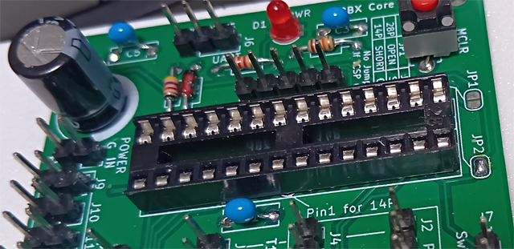
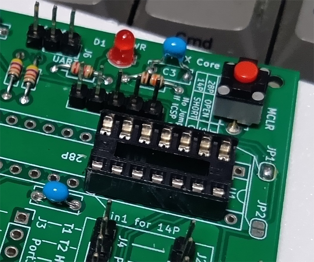

# PBXCore

## これは何？

アナログPBX開発プロジェクトのうち、実際の交換処理のみを行う部分です。最大4回線(8まで拡張可能)に対応するPBXのコア部分です。

この部分は必ずしもPICで実装する必要はありません。SLICユニットとスイッチボードユニットのインタフェース仕様さえ守れれば何のプラットフォームで何のプログラムを使って書こうが自由です。様々なプラットフォームで交換機機能をつくれるように、各機能をユニット化しなるべく少ないピン数で制御できるようにしているのが、このプロジェクトの意味です。

- [ライセンス](#ライセンス)
- [回路](#回路)
- [BOM](#bom)
- [回路&基板の使い方](#回路基板の使い方)
- [ちょっと説明](#ちょっと説明)
- [使い方](#使い方)
  - [オートアンサモード](#オートアンサモード)
  - [ホットライン機能](#ホットライン機能)
- [回線拡張](#回線拡張)

## ライセンス
大元のプロジェクトライセンスに準じます。好きに使ってかまいませんが、改変する場合には継承表示をしてください。ただし商用利用(製品化、キット化、講習会を含む)は禁止です。商用利用したい場合には別途ご相談ください。

## 回路

回路図はこのディレクトリにPDFで置いてあります。

特筆すべきことのないPICの回路・・・と言いたいところなのですが、基板を流用したいがために変な実装をしています。回路図中でPICのシンボルの『内側』に別な信号が書かれていますが、これがそうです。

基本のPICは16F18857(28ピン)なのですが、同じ基板で16F18326を使って2回線用のPBXもつくることができるようにしています。ただし、PICの実装方向が異なるので注意してください。詳しくは後で説明します。

## BOM
|部品番号|数量|値|備考|
|-----|-----|-----|-----|
|C1,C3,C4,C5|4|0.1uF|5mm|
|C2|1|470uF|電解|
|D1|1|LED|電源表示用|
|R1|1|10k||
|R2|1|2.27|
|R3,R4|2|4.7k||
|U1|1|PIC16F18857|28ピン ソケット|

2回線用を作る場合にはU1に16F18326を使用します。

## 回路&基板の使い方

28ピンPIC(16F18857)を使う場合にはシルクの『普通の』向きに28Pソケットを実装し、JP2をハンダでショートします。JP1は開放です。

14ピンPIC(16F18326)を使う場合にはシルク上の"Pin 1 for 14P"の位置が1番ピンとなるように14Pソケットを実装し、JP1をショートします。JP2は開放です。

同じ基板で2回線、4回線がつくれるので便利でしょ？どちらのPICでもICSPやI/O(SLICユニット接続部)などに違いはありません。

ただしPICに書き込むプログラムは異なりますので注意してください。当たり前といえば当たり前なのですけども。

R3,R4はゴーストパワー防止用ですが、これでもなおLEDは点灯します。

PBXのコア部分なのに回路としては一番簡単で、やたらと線が多いだけです。各SLICユニット制御のために4x4=16ピンを消費します。なおSLICユニット側には回線リバースのピンがありますが、このPBXコアでは回線リバース制御を行わないので、SLICユニット接続部である5ピン(+GND)との接続に注意してください。通常の電話機の場合には回線リバースは必要ないので省略しています。

なお、開発環境用のファイルは28ピン(16F188157)用です。14ピン(16F18326)用はサブディレクトリにHALと.mc3ファイルを置いてありますので利用してください。

2回線、4回線どちらをつくる場合でも基板は共通ですから、28/14で同じデータで基板を製造することができます。

## ちょっと説明

ちょっとだけ説明を付け加えます。PBXのコアプログラム(main.c)自体は全て共通です。PICが異なることによるピンの配置はMCCで吸収し、ハードウエア制御関連の部分はHAL(hal_pbx)で吸収しています。これによりmain.cは全てのアーキテクチャで共通で、2回線専用のミニPBX
 https://github.com/takao-t/Mini-pbx 
でも同じものが使われています。ミニPBXの場合にはスイッチボード(交換台)そのものが実装されていないので、HAL内部で単純なスイッチ制御に置き換えるということをやっています。

PBXコアが行う処理は基本はステートマシンです。各回線の状態を管理し、その状態に応じて処理を決めます。必要な回線数分の状態をCPUでぶん回して管理しています。

PBXのコアからスイッチボード(交換台)を制御するのはシリアル(UART)1本で、これは『投げっぱなし』です。動作したかどうかの確認は行っていません。そもそも音声スイッチ部分なので音声が通らないとすぐに気付くからです。

シリアルでスイッチボードを制御するためには2x2のスイッチのユニット1個にコマンドを投げるだけです。あとはスイッチボードの各ユニットがコマンドを適切にルーティングして必要な個所のON/OFFを行ってくれます。

もし同様のことをRaspberry Pi等で行いたいのであれば、16ピン分のGPIOを確保し、UARTのTXを1ピン確保するだけで同じことができます。SLICユニットとスイッチボードの仕様を伝えればAIがPythonとかでよしなに書いてくれると思います(たぶんね)。

マルチタスクOS上で交換プログラムを書くのなら各SLIC毎に実行されるマルチプロセスにして、各電話機を"エンティティ"化するのがお勧めです。PICのように「ぶん回し」方式で多回線を処理するよりもスマートですし、プロセス間の状態受け渡しにはTCP/IPが使えます。

Raspberry PiのPythonでSLICを直接制御したプログラムがありますので参考にしてください。この例ではSLICユニットではなく、SLICモジュールを直接制御しているため、トーン生成やデバウンスもPythonのプログラムで行っていますので、そのままでは使えない点に注意してください。

https://github.com/takao-t/phone_use_slic

## 使い方

設定や動作確認はシリアルコンソールで行えます。UARTのピンにUSBシリアル等を接続すると使えます。

<pre>
PBX> help
---Commands---
STAT    : Display current Status.
SET EXT : Set extension(number) for each port.
          Usage: SET EXT <port:1-4> <ext:10-99>
SET AA  : Set port to AUTO ANSWER mode.
          Usage: SET AA  <port:1-4> <ON/OFF>
SET HL  : Set port HOTLINE number
          Usage: SET HL <port:1-4> <ext:10-99 or OFF>
SBCTL   : Manually ON/OFF/FULL_RESET Switchboard.
          Usage : SBCTL CON/REL <port1> <port2>
          Example: SBCTL CON 1 2   - Connect 1 and 2 Switch.
          Example: SBCTL REL 1 2   - Release 1 and 2 Switch.
          Example: SBCTL FULL_RESET  - Reset Switchboard.

SAVE_TO_EEPROM : Save current settings to EEPROM.
DO_FULL_RESET  : Reset PBXCore program.
--------------

PBX>
</pre>

SLICユニットの接続先は外部的には"LINE"ですが、PBXのプログラムは"Port"で呼称しています。LINEとPortはほぼ同じ意味なので、LINE1ならPort1とそのまま読み替えてください。

内線番号はデフォルトは2桁です。桁数を変更するにはソースを修正する必要があります。

内線番号を変更するには
<pre>
PBX> SET EXT 1 21
</pre>
のようにします。上記を実行すると1番のSLICユニットの内線番号が21になります。

手動で音声を繋いでみたい場合には
<pre>
PBX> SBCTL CON 1 3
</pre>
のようにすると、1と3の音声を相互に繋ぎます。

設定値をEEPROMに保存する場合にはSAVE_TO_EEPROMコマンドを実行してください。DO_FULL_RESETコマンドはPBXコアを再起動します。EEPROMの初期化は行いません。

シリアルコンソールを繋いでおくと動作状態も確認できます。どう動いているかを確認するのに使ってください。
<pre>
Port 1: Off-Hook -> DIALTONE
Port 1: Dialing started -> DIALING
Port 1: Digit 1 received
Port 1: Digit 3 received
Port 1: Number complete -> ROUTING
Port 1: Calling Port 3 -> CALLING
Port 3: Answered Port 1 -> TALKING
Port 3: Hung up during talk. Port 1 is now BUSY.
Port 3: Hung up. -> IDLE
Port 1: Hung up. -> IDLE
Port 2: Off-Hook -> DIALTONE
Port 2: Dialing started -> DIALING
Port 2: Digit 1 received
Port 2: Digit 1 received
Port 2: Number complete -> ROUTING
Port 2: Calling Port 1 -> CALLING
Port 1: Answered Port 2 -> TALKING
Port 1: Hung up during talk. Port 2 is now BUSY.
Port 1: Hung up. -> IDLE
Port 2: Hung up. -> IDLE
</pre>

PBXコア上にUSBシリアル付けとけや！というご意見もありましょうが、初期の設定を行ったあとはあまり使わないので付けませんでした。USBコンソール付きのPBXコアも魅力的なので、良さそうと思ったら自分で作ってみてください。PICのピン配置を同じにしておけばコードはそのまま使えますよ。

### オートアンサモード
<pre>
PBX> SET AA 4 ON
</pre>
オートアンサモードは特殊なモードで、オートアンサが指定されているポートは着信があると自動で応答し、呼を成立させます。このとき、SLICユニットが繋がっていようが繋がっていまいがお構いなしです。

これは何に使うのかというと例えばポート4(スイッチボードの4)にラジオ等の音源を繋いでおきます。PBXのポート4にはSLICユニットを繋ぎません。こうすると内線14(デフォルト)にダイヤルすると、電話機からラジオが聴けるようになります。また、PA(拡声装置)にスイッチボードを繋いでおけば、そのポートは館内放送等の拡声器として使えます。この場合にもSLICユニットは必要なく、スイッチボードの音声出力4番をPAに繋ぐだけです。

なお、外部機器の音声と繋ぐ場合にはDCバイアスに注意してください。スイッチボードから出て行く音声はSLICユニットによるmid-railのDCバイアスがかかっているので、Cで直流分を切ってから外部機器に入力します。逆にスイッチボードに音声を入力する場合には抵抗分圧などでmid-railのDCバイアスを加えて入力してください。

### ホットライン機能
<pre>
PBX> SET HL 1 13
</pre>
ホットラインはご存じの通り受話器を上げただけで自動でダイヤルする機能です。上記の設定例では1番の電話機の受話器を上げたら内線13に電話します。受付電話などに便利な機能ですね。

## 回線拡張

I2CのI/Oエキスパンダ(MCP23017)を使うことで、PBXコアの回線数を8まで拡張することができます。現在のプログラムではこの拡張機能は自動認識なので、I2Cエキスパンダが正しく接続されていれば最大回線数8として起動するはずです。この処理とI2C、エキスパンダ経由でのSLICユニット制御いずれもHALで吸収しています。

I/Oエキスパンダ用の基板データもこのディレクトリに置いてあります。回路として特に面白いことは何もありません。

8回線までは対応するものの、8回線を実装しようとするとスイッチボードが大変なことになります。横4×縦4=16個のスイッチユニットを接続しなければならないので、かなり面倒です。やる気のある人はチャレンジしてみてください。
