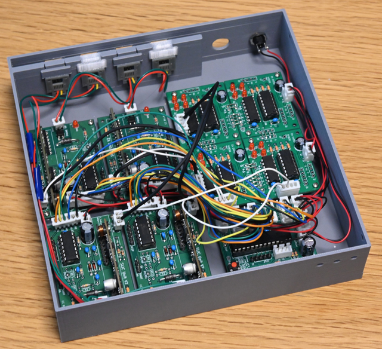

# アナログPBX開発環境

## これは何？

アナログPBXを開発するためのハード/ソフト一式です。必要な機能をそれぞれコンポーネント化することにより、お好みの方法でアナログPBXをつくることができます。

※ VSCodeでのPIC開発環境の公開方法がよくわかっていないので、もし足りないファイル等があればご連絡ください。VSCodeでMCCを使ったPICの開発環境、あまりにも便利なので開発がめちゃめちゃ進む一方、MCCのUpdate等で挙動の変化に振り回されたりもしています。

## ライセンス

うるさいことは言いません。好き勝手に使ってください。ですが改変する場合には継承していることを示すようにしてください。とはいえ、商用利用(製品化・キット化・講習会含む)は禁止します。商用利用したい場合には別途お問い合わせください。

なお、ソースコードの作成には生成AI(Google Wrokplace版のGemini)を使用しています。

## と、その前に

2回線だけ、つまり1:1でリンリンもしもしで遊びたい場合には、このプロジェクトの派生であるミニPBXを利用してください。拡張性は一切ありませんが、簡単ですし、ケースに入れると、まとまりが良くなっています。ただしこのミニPBXはダイヤル式電話専用です。黒電話2台を展示するには最適かもしれませんね。

https://github.com/takao-t/Mini-pbx

もうひとつ最初に言っておくことがあるとすれば、このプロジェクトの構成部品は全てスルホール品で構成していることです。特別な道具がなくともハンダ付けして作って楽しめることを目標としています。手作り交換機なんてワクワクしませんか？

## なぜ？

なぜ今さらになって新しくPBXを作るのかと疑問に思われるでしょう。黒電話をオモチャにして遊ぶ電子工作などが割と人気があるのも背景としてはあります。

スマホに対するガラケーを見てもわかるように、昔の電話機はデザインからして多様性があります。そして今の時代からみてもかなり「イカす」デザインのものが多くあります。例えば昨今ではアメリカンビンテージとして、昔のAT&Tの電話機が輸入販売されていたりして、インテリア小物として飾られたりしています。

当時はこんなイカした電話もありました。

ですが電話機はインテリア小物として作られたわけではなく、もともとは通話するための装置として作られた工業製品です。なので単に飾っておくのは勿体ないので、使える状態、つまりダイヤルして通話してという機能のまま飾りたいと思いませんか？

そんなわけでこのプロジェクトを始めました。

もうひとつ理由があるとすれば、今のところSLICモジュールが比較的容易に入手できることがあります。SLICモジュールはもともとVoIP機器にレガシーな電話機/FAX等を対応させるためのもので、いわば過渡的な『部品』と言えます。SLICモジュールを使うことで昔のアナログ電話機を活かすことができます。

さらに理由を付け加えると生成AIの登場です。PBXのようなプロジェクトは、その仕組みと何を実装すれば良いのかがわかってはいても、いざコードを書こうとすると、かなりの重労働です。しかも自分が書いた信用できないコードをデバッグしていると、あっという間に数年の時間が過ぎることでしょう。

コード書き部分を生成AIにある程度任せられるようになったことで、このプロジェクトを『やる気』になったことは否定できません。何せ個人プロジェクトです。楽して結果を得たいよね。

SLICモジュールが手に入らなくなったらどうするの？という疑問はあるでしょう。その場合はSLICモジュールから作らなくてはいけませんね。

## そもそもPBXって何なのよ？

PBXはPrivate Branch eXchangeのことで、日本語では『構内交換機』と呼ばれます。簡単に言ってしまうと、ちっこい電話局のようなものです。

私が得意としているOSSのAsteriskもPBXの一種で、今ではIP-PBXとして良く知られていますが、もともとはアナログがベースにありました。なので電話機を繋いで遊ぶには最適だったのですが、安価なアナログカード(Wildcard等)がもはや入手困難になり、アナログ回線ではあまり使われなくなっています(アナログを接続したい場合にはIP化してから繋ぐため)。加えてLinuxサーバを用意しないと使えませんから、ここで紹介している『ノリの軽い』PBXには向いていません。

もともとPBXのコア部分(番号の処理、呼制御を行う部分)にはPyhton等で簡単にプログラムが書けるRaspberry Pi等を使用することを想定していました。ですが昨今、Raspberry Piもお安い値段ではありません。なので、PBXのコア部分もPICマイコンでつくり、PBX一式分のコンポーネントを提供することとしました。

## コンポーネント

3つの部分に分けられます。

トップのPBX制作例の画像を上から見るとこのようになっています。配線は外してあります。

### SLICユニット

左側半分、4枚のユニットが"SLICユニット"で、これは加入者回線、つまり電話機の制御を直接行う部分になります。回線数分のユニットが必要で、この例では4回線に対応しています。

SLICユニットからPBXのコアに対して番号の情報はダイヤルパルスで伝達されます。ですが、これだけではちょっと面白くないのでSLICユニット自体にDTMF(トーン信号)検出機能を載せており、トーン->パルス変換を行うことでトーン式の電話機も使えるようにしてあります。要するにトーンしか使えない昔のプッシュホンも使えるようになります。

SLICユニット単体でもある程度遊べるようにしてあります。ベルを鳴らしたりトーンを聞かせたりだけならば単体でOKです。

### スイッチボード

右上の大きな面積を占めているのがスイッチボード(Switchboard)で、これは交換台の機能です。交換台というのが何をするのかというと、例えば回線1と回線3を繋ぐ場合には、その音声信号を1と3の間で繋ぐということを行います。電話交換手が操作する配線繋ぎ替え部分ですね。

実はこのスイッチボードがちょっと厄介な部分で、1ユニットは2回線対応ですが、必要な回線数分を縦・横に増やす必要があります。写真のものは4回線対応なので4X4ですが、1ユニットあたり2回線なので 2x2 = 4 ユニットが必要になります。では8回線対応にしようとすると、4x4 = 16 ユニットを繋がないといけません(ひぃ)。

我ながら賢い設計だと思ったのですが、人力量産しないと使えないというのがちょっと難点ですかね。

### PBXコア

右下の小さいものがPBXのコアユニットで、ここが呼制御(こせいぎょ)を行います。受話器が上げられたら音を出したり、ダイヤルされたら相手の状態を確認し、接続したらスイッチボードに対し音声の接続を依頼し、通話中はその状態を管理します。電話が切られたら音声の切断を指示し、といったことを行うのはこのPBXコアです。

PBXのコア部分は何を使って実装してもかまいません。このプロジェクトでは電話機の制御には4ピンのデジタルI/O、スイッチボードの制御にはシリアルコマンドで行っており、この仕様を充足すればPBXコア部分には何でも使うことができます。プログラミングが得意ならRaspberry PiでPythonで書くこともできます。

各ユニットの詳細についてはユニット毎の説明を読んでください。

## 拡張

詳しくはPBXコアの説明を読んでください。制作例の構成は4回線までですが、PBXコアをI2CのI/Oエクスパンダで拡張すると8回線まで対応可能にしてあります。ただし回線数を増やすとスイッチボードがどんどん巨大化して作るべきユニット数が2乗で増えますので覚悟してください。

## 使用するPIC

目的に応じてPICを使い分けています。

SLIC : PIC 16F18326 (14ピン)

Switchboard : PIC 16F18323 (14ピン)

PBXCore : PIC 16F18857 (28ピン)

実はスイッチボードは16F18326でも動きます。もったいないのでケチっているだけです。PBXCoreも2回線だけでよければ16F18326でも動きます。3回線以上に対応しようとするとピンが足りないので28ピンPICを使っています。

単にPICに書き込んで使うだけであれば、各ディレクトリの下、out/プロジェクト名 のディレクトリ下にあるdefault.hexファイルをPICに書き込んで使ってください。PICへの書き込みにはMicrochip MPLAB IPEとSnap等の書き込みツールが必要です。

## 全般的な注意

全ユニットは実験/試作しやすいように入出力は2.5mmピンヘッダを実装するように設計しています。ジャンパワイヤで接続してもいいですし、QI(2550)コネクタで結線してもかまいません。制作例の写真のように無理やりXHを付けるのもアリです。

すべてのネジ穴は小さめです。2mmのセルフタップネジが適合します。

4回線用PBXの場合にはケースも用意していますので、ご利用ください。モジュラージャックには「よく売っている」リード付のスロット装着タイプが使えます。

https://www.thingiverse.com/thing:7383778

## 開発環境

ソースを修正し、ビルドしたい場合には自分でがんばってください。開発環境にはVScode + MPLAB X extension + MCCを使用しています。言語はCです(XC8)。基本的にソースファイル(.c,.h)とMCCの設定ファイル(.mc3)があれば、何とかなるはずです。MCC(Melody)が今のところかもしれませんが、時々、妙なことになるので自分でビルド環境を作ってから、そこへソースとMCCの設定ファイルを移行するのが良さそうな気がしています。noteに方法を書いていますので、ご参考までに。

https://note.com/tsq/n/n2b38f7ed411e

全般的な注意点として、ピンの"名前"による指定でI/Oを抽象化しているところが多いのでMCCが必須になるところでしょうか。加えてCIPを使っている部分が多々あるのでMCCが使えないと動きません(コード外に処理がある)。
