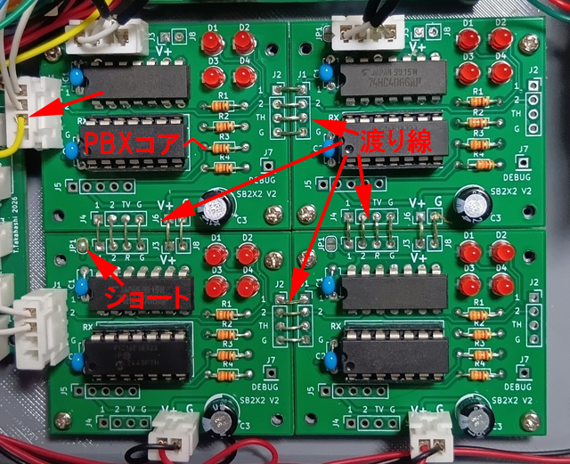

# スイッチボード

## これは何？

アナログPBX構築用のスイッチボードです。基本ユニットは2x2の2回線用ですが自動拡張機能を持ち、繋げて拡張することで多回線にも対応します。

- [ライセンス](#ライセンス)
- [しくみ](#しくみ)
- [で、なに？](#でなに)
- [回路](#回路)
- [BOM](#bom)
- [コマンド](#コマンド)
  - [初期化コマンド](#初期化コマンド)
  - [接続/開放](#接続開放)
- [デバッグ](#デバッグ)
- [ゴーストパワーに注意](#ゴーストパワーに注意)
- [感想文](#感想文)

## ライセンス
大元のプロジェクトライセンスに準じます。好きに使ってかまいませんが、改変する場合には継承表示をしてください。ただし商用利用(製品化、キット化、講習会を含む)は禁止です。商用利用したい場合には別途ご相談ください。

## WIP

現在もうちょっと簡素化したものを開発中です。待てる人は待っててください。

## しくみ

4066アナログスイッチをPIC 16F18323で制御しています。コマンドはシリアルで送り、どのスイッチをオン/オフするかを指定します。

ここから話がヤヤコシクなります。

基本ユニットは2x2のクロスポイントスイッチです。

<pre>
   1  2
   |  |
1--+--+--
   |  |
2--+--+--
   |  |
</pre>
スイッチは各交点(+)に配置されます。2x2のクロスポイントなので、この構成で1-1,1-2...と相互に接続することができます。

実際にSLICユニットと接続する場合には以下のようにします。
<pre>
       Vout
       1  2
       |  |
    1--+--+--
Vin    |  |
    2--+--+--
       |  |
</pre>
それぞれのSLICユニットの音声入出力を縦か横に寄せて繋ぎます。上の例では縦列をVout、横行をVinとしています(逆でもかまいません)。

1と2の通話を成立させるにはVin1とVout2、Vin2とVout1をONにします。そうすると双方向で音声接続が成立するので通話できるというわけです。

2回線の場合にはこの接続しかあり得ないので1-1と2-2はスイッチは不要なのですが、拡張する際に必要になるので実装しておきます。

では4回線の場合を見てみましょう。
<pre>
       Vout
       1  2  3  4
       |  |  |  |
    1--+--+--+--+--
Vin    |  |  |  |
    2--+--+--+--+--
       |  |  |  |
    3--+--+--+--+--
       |  |  |  |
    4--+--+--+--+--
       |  |  |  |
</pre>
4回線の場合にはこうなります。1-3間で通話を成立させたい場合にはVin1とVout3、Vin3とVout1を接続する必要があります。
<pre>
       Vout
       1  2  3  4
       |  |  |  |
    1--+--+--O--+--
Vin    |  |  |  |
    2--+--+--+--+--
       |  |  |  |
    3--O--+--+--+--
       |  |  |  |
    4--+--+--+--+--
       |  |  |  |
</pre>
これを2x2にバラして書くとわかりますが「斜め」の位置が必要になります。
<pre>
       Vout
       1  2    3  4
       |  |    |  |
    1--+--+-  -O--+--
Vin    |  |    |  |
    2--+--+-  -+--+--
       |  |    |  |

       |  |    |  |
    3--O--+-  -+--+--
       |  |    |  |
    4--+--+-  -+--+--
       |  |    |  |
</pre>
ね？斜めの位置のスイッチが要るでしょ？何の話かわからない？そうでしょうそうでしょう。

このスイッチボードは2x2を基本でつくり、2X2を右と下に拡張ができるようにしたクロスポイントスイッチだというのは最初に言いました。

ここからがミソの話で自動拡張が可能になっている話です。

もういちど分解して確認しましょう。
<pre>
       Vout
       1  2      3  4
       |  |      |  |
    1--+--+-  1--O--+--
Vin    |A |      |B |
    2--+--+-  2--+--+--
       |  |      |  |

       1  2      3  4
       |  |      |  |
    3--O--+-  3--+--+--
       |C |      |D |
    4--+--+-  4--+--+--
       |  |      |  |
</pre>
それぞれのスイッチのユニットをA,B,C,Dとしました。各ユニットが接続される先はVoutの1,2,3,4とVinの1,2,3,4です。この時点で法則性に気付きましたか？

2x2のユニット、左上のAを基本とするとユニット自体が接続する個所は1-1,1-2,2-1,2-2の4か所です。では右のユニット、Bに行くと今度は1-3,1-4,2-3,2-4の4か所となります。

Aのユニットに対して"1-3"を繋いでくださいと指示を出したとします。ですがAのユニットは1,2しか持っていないのでAのユニットそれ自体では接続することができません。そこで、どうするかというと右のユニットBに"1-3"の接続を依頼します。

ところがBのユニットをよくよく見ると『Aのユニットとまったく同じで番号が違う』だけに気付きます。縦側が3,4になっているだけですね。

そこでAのユニットは"3"という数字を『自分が持っていない』と気付いたら、『3から2を減じて右に投げる』という動作をします。

<pre>
       Vout
       1  2         1  2
       |  |         |  |
    1--+--+-     1--O--+--
Vin    |A |  ->     |B |
    2--+--+- -2  2--+--+--
       |  |         |  |

    ↓ -2

       1  2         1  2
       |  |         |  |
    1--O--+-     1--+--+--
       |C |         |D |
    2--+--+-     2--+--+--
       |  |         |  |
</pre>
縦横ともに『自分が持っていないスイッチ』を指定されたら2を減じて、縦または横に投げるという処理をすれば、全てのスイッチユニットは2x2の1,2を持つスイッチで実現できるというわけです。

ただし右下(D)へのユニットへの『経路』が問題になるので、必ず『縦』を優先して送るような制御とします。そうすると、右下の4-4の位置に到達するには 4-4 縦(-2)> 2-4 横(-2)> 2-2 といった経路で右下まで辿りつきます。なので自分の持っているスイッチよりも大きい番号が来た場合には、まず縦が大きければ縦に投げ、横が大きければ横に投げるといった経路設計をすることで全てのユニットに到達可能な制御が実現されています。

アナログのクロスポイントスイッチはPBXが大量に作られてた時代ならば、オーディオ帯域用のクロスポイントで安価なチップが売られていたのですが、昨今は入手の容易なものがなく、クロスポイントのチップといえばHDMI等の映像信号用となり高価ですし、実装が難しいです。なので、アナログスイッチの基本である4066で実装し、これを繋げていくことで拡張可能なものとしました。このため各4066は高価なPIC(180円もする!)で制御されるという贅沢な構成です。もともとこの部分も16F18326で実装していたのですが、16F18323にすることで80円も節約できました！

## で、なに？

要するにこれは音声を繋いだり切ったりするものなのでスイッチボードと呼んでいます。Switchboardとは電話業界では交換台といわれ、はるか昔では電話交換手がケーブルを抜き差しして繋いだり切ったりしてたもののことを言います。交換機能を行う部分から依頼を受けて、音声を繋いだり切ったりする部分です。

## 回路

回路図はこのディレクトリにPDFが置いてあります。アナログスイッチのオン/オフだけなので簡単です。

制御はシリアル(UART)の9600bpsで行います。回路的にちょっとヤヤコシイのは送信に縦(TX_V)と横(TX_H)があることです。受信はRXひとつしかありません。複数ユニットを組み合わせる場合には次のように接続します。
<pre>

PBXcore --> RX-[A]-TX_H --> RX-[B]
                |
                |TX_V
                |
                RX
                |
               [C]-TX_H --> RX-[D]
</pre>
左上(A)のユニットはPBXコアからの依頼を直接受け取ります。このユニットは下と右(CとB)への送信が接続されます。下のユニットの受信(RX)は縦側の送信と繋ぎます。

つまり、ユニットをいっぱい繋ぐ場合には左上だけがPBXからの接続要求を受け付け、左の縦方向は「縦を受信」し、そこから横へは「横を受信」する方法で拡張していきます。この方法で4X4でも16X16でも実現可能なのですが、8回線対応にしようとすると、1ユニットが2回線なので4x4=16個もユニットを作らないといけないという地獄になります(ひぃ)。ただし良い面もあります。2回線(1個)から始めて4回線(4個)へとステップアップが可能なところです。でも2乗で効いてしまうので増やせば増やすほど大変なことになるのですが。ちなみに9個(3x3)だと6回線対応になります。

シリアル通信は各ユニット内で方向に応じて2を減じて次のユニットにこれまたシリアルで投げられます。このため一番遠いユニットまで到達するにはそれなりの時間がかかりますが、電話という人間相手の処理なので多少時間がかかったところで何の問題もありません。

なお、全てのユニットは同一です。プログラムも同じなので同じものをたくさん作るだけです。ただし接続する際には『左列』になるユニットは縦受信にする必要があるのでハンダジャンパを設けてあります。

このスイッチボードでは音声信号を扱いますが、DCバイアスはスイッチボード内では行っておらず、このまま使うと0～5Vしか扱えません。音声信号を通したい場合には外部でDCバイアスしてください。SLICユニットを使用する場合にはSLICユニット側でDCバイアスされるようになっています。

## BOM

|部品番号|数量|値|備考|
|-----|-----|-----|-----|
|C1,C2|2|0.1uF|5mm|
|C3|1|100uF|電解|
|D1,D2,D3,D4|4|LED|3mm|
|R1,R2,R3,R4|4|2.2k|LEDの電流制限抵抗|
|U1|1|74HC4066||
|U2|1|PIC 16F18323|14ピン ソケット|

難しい部品は何もありません。D1～D4、R1～R4はデバッグ表示用のLEDなので必要なければ実装しなくていいです。これが付いていると逆探知ごっこができるのと起動時に派手になること位でしょうか。

部品そのものは難しくないのですが、実装は各自で工夫してください。単純に縦横に並べると面積がどんどん広くなっていくだけなので、それこそ8回線対応にしようとすると立体配置が必要になるかもしれません。

基板データもこのディレクトリに置いてありますが、基板の左右と上下は隣の基板と配線で繋ぎやすいようにレイアウトしてあります。上下方向は電源の渡り線も実装できます。

4回線(2x2)ならば写真のように渡り線で接続して4枚ならべても面積は大したことにはなりません。この構成の場合、PBXコアからのコマンドは左上のユニット、左のコネクタの無印のところ(1,2の下、Gとの間)がRXになっているので、そこへ接続します。

左下のユニットは縦方向のコマンドを受信しなくてはいけないので、JP1をハンダジャンパーします。同様にしてユニットを増やしていく場合には『左端列』の基板だけはJP1をショートしてください。

写真では右の上下の基板もTVとRが繋がっていますが、JP1がオープン状態では、この部分で受信は機能しません。

もし、基板をすべて「均一」にして、ハンダジャンパをショートしたくない場合には『上』のユニットのTX_V(TV)をJ1(1,2, ,Gになってるやつ)のRX(マーキングしていない個所)に接続する必要があります。ジャンパワイヤ等で接続する場合ならば、この方法を使うと『全てのユニットが物理的にも同じ』状態になります。

要するにJP1は縦受信と横受信をショートするために設けてあります。ですので「左端ではない」基板ではJPはショートしないでください。信号線が衝突します。

電源は上下には渡りがありますが左右にはないので、各列に外部電源供給用のコネクタを設けます。

## コマンド

シリアル(UART) 9600bps、0x0d終端です。

|コマンド|意味|
|-----|-----|
|RFFFF|(グローバル)フルリセット|
|Caabb|縦aa、横bbのスイッチをオン|
|Raabb|縦aa、横bbのスイッチをオフ|

### 初期化コマンド
電源投入時にはソフトウェアシリアルのポートが乱れて、UARTが正しく動作しない可能性があるため、RFFFFを、ユニットを繋いだ段数以上、送ってください(2x2なら2回以上、3x3なら3回以上)。ユニットがRFFFFを受け取ると、RFFFFは縦横ともに中継して送られるため、全ユニットがリセットされます。

この初期化が実行されていない状態では全LEDが点滅します。スイッチもオン/オフしているので音声を流すとぶっつんぶっつんしているはずです。初期化が完了するとLEDは消灯します。

### 接続/開放

スイッチを接続するにはC0102のように実行します。ただし、こちら側の音声と相手側の音声を繋がないといけないのでC0102とC0201はセットで実行する必要があります。この部分は電話交換台なので、同時に実行するようにしてもよかったのですが、バラのスイッチ制御ができれば他の用途にも使えそうなので個別スイッチのオン/オフができるようにしてあります。

## デバッグ

ユニットにはデバッグピンがありますが、これはUARTのTXです。

## ゴーストパワーに注意

回路自体の消費電力が小さいため、PICとスイッチがゴーストパワーで動いてしまうことがあります。例えば縦列の電源を繋ぎ忘れている場合でも、隣の横からのゴーストパワーで動作してしまうことがあるので電源の繋ぎ忘れに注意してください。ゴーストパワーで起動しても不安定な動作になります。

## 感想文

回路的には簡単なのに、仕組みを説明するのが面倒ですねこれ。仕組みを理解してしまえば簡単ですが。

この仕組み、AIも『何と美しい実装でしょう！』とかお世辞を言ってました。

我ながら見事な実装だとは思うのですが、クロスポイントスイッチを実現するために、最後は『数の暴力』が効いてくるので現物を作るという点では面倒ですね。

もし、他のクロスポイントスイッチ用ICを使って製作するのであれば、コマンドを共通にしておけば本プロジェクトのスイッチボードとして動作させることができます。