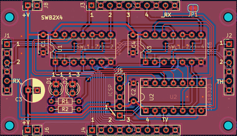

# スイッチボード 2X4

## これは何？

アナログPBX構築用のスイッチボードです。基本ユニットの2x2の2回線用を拡張し横方向のスイッチが予め増設されたスタイルになっています。

動作のしくみ等は基本となっている2x2( https://github.com/takao-t/analog-pbx/tree/main/SB_2X2 )を参照してください。このスイッチボードでは2x2を横に拡張した2x4を1枚の基板で実装しています。つまり各ユニットは縦1,2と横1,2,3,4を持ったクロスポイントスイッチになっています。

4回線以上を実装したい場合に楽になるように、ちょっと部品点数を減らして構成してみました。

- [ライセンス](#ライセンス)
- [回路](#回路)
- [変更点](#2x2からの変更点)
- [BOM](#BOM)
- [コマンド](#コマンド)
- [デバッグ](#デバッグ)

## ライセンス
大元のプロジェクトライセンスに準じます。好きに使ってかまいませんが、改変する場合には継承表示をしてください。ただし商用利用(製品化、キット化、講習会を含む)は禁止です。商用利用したい場合には別途ご相談ください。

## 回路

基本的な回路は2x2のスイッチと同じですが、1個のPIC(16F18323)で2個の4066を制御します。これにより2x2よりも低コストで多回線に対応できます。4回線対応のスイッチボードをつくるには、この2x4のユニット2枚だけです。8回線対応の場合には8枚(縦4x横2ユニット)必要になります。

2回線のみの対応で使いたい場合には回路中のU3、4066を実装する必要はありません。プログラムは4066が接続されているかどうかを確認していないので、左側の4066だけで動作し、この場合には2X2のスイッチボードとして動作します。

## 2X2からの変更点
- PICのピンをできる限り使い14ピンPIC 1個で4066 2個を制御するようにしました
- デバッグポート(UARTのTX)は廃止しました
- 配線効率の問題から全スイッチに搭載していたLEDをやめ、1-1と1-3(各スイッチの左上)だけにLEDを搭載することにしました
- 各接続ピンの並びを信号とGNDのペアとしたことでシールド線等での接続が容易になっています。
- 4回線対応する場合には『縦』に1枚増設するだけになりました

なお、当然ですが2x2とはプログラムが異なります。また制御ピンの配置も変えているため2x2用のプログラムは使えませんので、本ユニット用のプログラムを書きこんで使ってください。

## BOM

|部品番号|数量|値|備考|
|-----|-----|-----|-----|
|C1,C2,C4|3|0.1uF|5mm|
|C3|1|100uF|電解|
|D1,D2|2|LED|3mm|
|R1,R2|2|2.2k|LEDの電流制限抵抗|
|U1,U3|2|74HC4066||
|U2|1|PIC 16F18323|14ピン ソケット|

難しい部品は何もありません。D1,D2、R1,R2はデバッグ表示用のLEDなので必要なければ実装しなくていいです。

部品そのものは難しくないのですが、実装は各自で工夫してください。単純に縦横に並べると面積がどんどん広くなっていくだけなので、8回線対応にしようとすると立体配置が必要になるかもしれません。

基板データもこのディレクトリに置いてあります。

4回線(2x2)ならば写真のように上下に2枚接続します。

PBXコアからの信号(UART)は「上」の基板のJ1コネクタ、RX部分に接続します。

下のユニットは縦方向のコマンドを受信しなくてはいけないので、JP1をハンダジャンパーします。同様にしてユニットを増やしていく場合には『左端列』の基板だけはJP1をショートしてください。

JP1は縦受信と横受信をショートするために設けてあります。ですので「左端ではない」基板ではJP1はショートしないでください。信号線が衝突します。

電源は上下には渡りがありますが左右にはないので、「右」へ増設する場合には各列に外部電源供給用のコネクタを設けます。

## コマンド

シリアル(UART) 9600bps、0x0d終端です。

|コマンド|意味|
|-----|-----|
|RFFFF|(グローバル)フルリセット|
|Caabb|縦aa、横bbのスイッチをオン|
|Raabb|縦aa、横bbのスイッチをオフ|

### 初期化コマンド
電源投入時にはソフトウェアシリアルのポートが乱れて、UARTが正しく動作しない可能性があるため、RFFFFを、ユニットを繋いだ段数以上、送ってください(2x2なら2回以上、3x3なら3回以上)。ユニットがRFFFFを受け取ると、RFFFFは縦横ともに中継して送られるため、全ユニットがリセットされます。

この初期化が実行されていない状態では2つのLEDが点滅します。スイッチもオン/オフしているので音声を流すとぶっつんぶっつんしているはずです。初期化が完了するとLEDは消灯します。

### 接続/開放

スイッチを接続するにはC0102のように実行します。ただし、こちら側の音声と相手側の音声を繋がないといけないのでC0102とC0201はセットで実行する必要があります。この部分は電話交換台なので、同時に実行するようにしてもよかったのですが、バラのスイッチ制御ができれば他の用途にも使えそうなので個別スイッチのオン/オフができるようにしてあります。

## デバッグ

2x4ユニットではデバッグピンは廃止しました。もし次段への送信が意図した通りに行われているかどうかを確認したい場合にはTHやTVをUSB UARTのRX等に接続すれば次段に送られているコマンドを確認することができます。

基板上のLEDは"C0101"と"C0103"で点灯します。

## ゴーストパワーに注意

回路自体の消費電力が小さいため、PICとスイッチがゴーストパワーで動いてしまうことがあります。例えば縦列の電源を繋ぎ忘れている場合でも、隣の横からのゴーストパワーで動作してしまうことがあるので電源の繋ぎ忘れに注意してください。ゴーストパワーで起動しても不安定な動作になります。